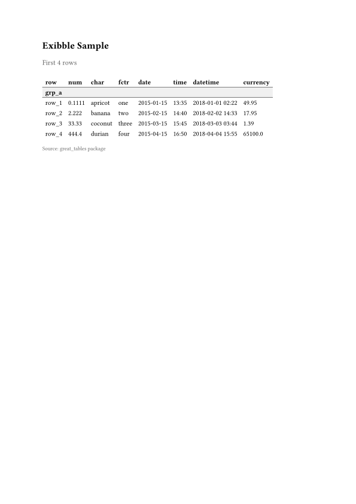

This demo shows the full pipeline: creating a table with Great Tables (Python), converting
to gridwell IR, and rendering to multiple formats.

## Python Code

```python
from great_tables import GT, exibble
import gridwell

# Create a GT table with groups, stub, and header
gt = (
    GT(exibble.head(4), rowname_col="row", groupname_col="group")
    .tab_header(title="Exibble Sample", subtitle="First 4 rows")
    .tab_source_note(source_note="Source: great_tables package")
)

# Convert to gridwell IR
table = gridwell.parse_ir(gridwell.gt_to_ir(gt))

# Validate
errors = table.validate()
assert errors == []  # ✓ valid
```

## Rendered Outputs

::: {.panel-tabset}

### HTML (rendered)

```{=html}
<div class="gw_container" style="margin: 1em 0; font-family: -apple-system, BlinkMacSystemFont, 'Segoe UI', sans-serif; font-size: 14px;">
  <div style="font-size: 18px; font-weight: bold; padding: 4px 8px;">
    Exibble Sample
  </div>
  <div style="font-size: 14px; color: #666; padding: 0 8px 8px 8px;">
    First 4 rows
  </div>
  <table style="border-collapse: collapse; width: 100%;">
    <thead>
      <tr style="border-bottom: 2px solid #000;">
        <th style="padding: 6px 10px; text-align: left; font-weight: bold;">row</th>
        <th style="padding: 6px 10px; text-align: right; font-weight: bold;">num</th>
        <th style="padding: 6px 10px; text-align: left; font-weight: bold;">char</th>
        <th style="padding: 6px 10px; text-align: left; font-weight: bold;">fctr</th>
        <th style="padding: 6px 10px; text-align: right; font-weight: bold;">date</th>
        <th style="padding: 6px 10px; text-align: right; font-weight: bold;">time</th>
        <th style="padding: 6px 10px; text-align: right; font-weight: bold;">datetime</th>
        <th style="padding: 6px 10px; text-align: right; font-weight: bold;">currency</th>
      </tr>
    </thead>
    <tbody>
      <tr style="background-color: #f0f0f0; border-top: 1px solid #d3d3d3; border-bottom: 1px solid #d3d3d3;">
        <td colspan="8" style="padding: 6px 10px; font-weight: bold;">grp_a</td>
      </tr>
      <tr>
        <td style="padding: 6px 10px;">row_1</td>
        <td style="padding: 6px 10px; text-align: right;">0.1111</td>
        <td style="padding: 6px 10px;">apricot</td>
        <td style="padding: 6px 10px;">one</td>
        <td style="padding: 6px 10px; text-align: right;">2015-01-15</td>
        <td style="padding: 6px 10px; text-align: right;">13:35</td>
        <td style="padding: 6px 10px; text-align: right;">2018-01-01 02:22</td>
        <td style="padding: 6px 10px; text-align: right;">49.95</td>
      </tr>
      <tr>
        <td style="padding: 6px 10px;">row_2</td>
        <td style="padding: 6px 10px; text-align: right;">2.222</td>
        <td style="padding: 6px 10px;">banana</td>
        <td style="padding: 6px 10px;">two</td>
        <td style="padding: 6px 10px; text-align: right;">2015-02-15</td>
        <td style="padding: 6px 10px; text-align: right;">14:40</td>
        <td style="padding: 6px 10px; text-align: right;">2018-02-02 14:33</td>
        <td style="padding: 6px 10px; text-align: right;">17.95</td>
      </tr>
      <tr>
        <td style="padding: 6px 10px;">row_3</td>
        <td style="padding: 6px 10px; text-align: right;">33.33</td>
        <td style="padding: 6px 10px;">coconut</td>
        <td style="padding: 6px 10px;">three</td>
        <td style="padding: 6px 10px; text-align: right;">2015-03-15</td>
        <td style="padding: 6px 10px; text-align: right;">15:45</td>
        <td style="padding: 6px 10px; text-align: right;">2018-03-03 03:44</td>
        <td style="padding: 6px 10px; text-align: right;">1.39</td>
      </tr>
      <tr>
        <td style="padding: 6px 10px;">row_4</td>
        <td style="padding: 6px 10px; text-align: right;">444.4</td>
        <td style="padding: 6px 10px;">durian</td>
        <td style="padding: 6px 10px;">four</td>
        <td style="padding: 6px 10px; text-align: right;">2015-04-15</td>
        <td style="padding: 6px 10px; text-align: right;">16:50</td>
        <td style="padding: 6px 10px; text-align: right;">2018-04-04 15:55</td>
        <td style="padding: 6px 10px; text-align: right;">65100.0</td>
      </tr>
    </tbody>
  </table>
  <div style="font-size: 12px; color: #666; padding: 4px 10px; border-top: 1px solid #eee;">
    Source: great_tables package
  </div>
</div>
```

### GT Native HTML

```{=html}
<div id="gt-native-demo" style="padding-left:0px;padding-right:0px;padding-top:10px;padding-bottom:10px;overflow-x:auto;overflow-y:auto;width:auto;height:auto;">
<style>
#gt-native-demo table {
  font-family: -apple-system, BlinkMacSystemFont, 'Segoe UI', Roboto, Oxygen, Ubuntu, Cantarell, 'Helvetica Neue', 'Fira Sans', 'Droid Sans', Arial, sans-serif;
  -webkit-font-smoothing: antialiased;
  -moz-osx-font-smoothing: grayscale;
}
#gt-native-demo thead, #gt-native-demo tbody, #gt-native-demo tfoot, #gt-native-demo tr, #gt-native-demo td, #gt-native-demo th { border-style: none; }
#gt-native-demo tr { background-color: transparent; }
#gt-native-demo p { margin: 0; padding: 0; }
#gt-native-demo .gt_table { display: table; border-collapse: collapse; line-height: normal; margin-left: auto; margin-right: auto; color: #333333; font-size: 16px; font-weight: normal; font-style: normal; background-color: #FFFFFF; width: auto; border-top-style: solid; border-top-width: 2px; border-top-color: #A8A8A8; border-right-style: none; border-right-width: 2px; border-right-color: #D3D3D3; border-bottom-style: solid; border-bottom-width: 2px; border-bottom-color: #A8A8A8; border-left-style: none; border-left-width: 2px; border-left-color: #D3D3D3; }
#gt-native-demo .gt_title { color: #333333; font-size: 125%; font-weight: initial; padding-top: 4px; padding-bottom: 4px; padding-left: 5px; padding-right: 5px; border-bottom-color: #FFFFFF; border-bottom-width: 0; }
#gt-native-demo .gt_subtitle { color: #333333; font-size: 85%; font-weight: initial; padding-top: 3px; padding-bottom: 5px; padding-left: 5px; padding-right: 5px; border-top-color: #FFFFFF; border-top-width: 0; }
#gt-native-demo .gt_heading { background-color: #FFFFFF; text-align: center; border-bottom-color: #FFFFFF; border-left-style: none; border-left-width: 1px; border-left-color: #D3D3D3; border-right-style: none; border-right-width: 1px; border-right-color: #D3D3D3; }
#gt-native-demo .gt_bottom_border { border-bottom-style: solid; border-bottom-width: 2px; border-bottom-color: #D3D3D3; }
#gt-native-demo .gt_col_headings { border-top-style: solid; border-top-width: 2px; border-top-color: #D3D3D3; border-bottom-style: solid; border-bottom-width: 2px; border-bottom-color: #D3D3D3; border-left-style: none; border-left-width: 1px; border-left-color: #D3D3D3; border-right-style: none; border-right-width: 1px; border-right-color: #D3D3D3; }
#gt-native-demo .gt_col_heading { color: #333333; background-color: #FFFFFF; font-size: 100%; font-weight: normal; text-transform: inherit; border-left-style: none; border-left-width: 1px; border-left-color: #D3D3D3; border-right-style: none; border-right-width: 1px; border-right-color: #D3D3D3; vertical-align: bottom; padding-top: 5px; padding-bottom: 5px; padding-left: 5px; padding-right: 5px; overflow-x: hidden; }
#gt-native-demo .gt_group_heading { padding-top: 8px; padding-bottom: 8px; padding-left: 5px; padding-right: 5px; color: #333333; background-color: #FFFFFF; font-size: 100%; font-weight: initial; text-transform: inherit; border-top-style: solid; border-top-width: 2px; border-top-color: #D3D3D3; border-bottom-style: solid; border-bottom-width: 2px; border-bottom-color: #D3D3D3; border-left-style: none; border-left-width: 1px; border-left-color: #D3D3D3; border-right-style: none; border-right-width: 1px; border-right-color: #D3D3D3; vertical-align: middle; text-align: left; }
#gt-native-demo .gt_row { padding-top: 8px; padding-bottom: 8px; padding-left: 5px; padding-right: 5px; margin: 10px; border-top-style: solid; border-top-width: 1px; border-top-color: #D3D3D3; border-left-style: none; border-left-width: 1px; border-left-color: #D3D3D3; border-right-style: none; border-right-width: 1px; border-right-color: #D3D3D3; vertical-align: middle; overflow-x: hidden; }
#gt-native-demo .gt_stub { color: #333333; background-color: #FFFFFF; font-size: 100%; font-weight: initial; text-transform: inherit; border-right-style: solid; border-right-width: 2px; border-right-color: #D3D3D3; padding-left: 5px; padding-right: 5px; }
#gt-native-demo .gt_row_group_first td { border-top-width: 2px; }
#gt-native-demo .gt_row_group_first th { border-top-width: 2px; }
#gt-native-demo .gt_table_body { border-top-style: solid; border-top-width: 2px; border-top-color: #D3D3D3; border-bottom-style: solid; border-bottom-width: 2px; border-bottom-color: #D3D3D3; }
#gt-native-demo .gt_sourcenotes { color: #333333; background-color: #FFFFFF; border-bottom-style: none; border-bottom-width: 2px; border-bottom-color: #D3D3D3; border-left-style: none; border-left-width: 2px; border-left-color: #D3D3D3; border-right-style: none; border-right-width: 2px; border-right-color: #D3D3D3; }
#gt-native-demo .gt_sourcenote { font-size: 90%; padding-top: 4px; padding-bottom: 4px; padding-left: 5px; padding-right: 5px; text-align: left; }
#gt-native-demo .gt_left { text-align: left; }
#gt-native-demo .gt_center { text-align: center; }
#gt-native-demo .gt_right { text-align: right; font-variant-numeric: tabular-nums; }
#gt-native-demo .gt_font_normal { font-weight: normal; }
#gt-native-demo .gt_font_bold { font-weight: bold; }
#gt-native-demo .gt_font_italic { font-style: italic; }
</style>
<table class="gt_table" data-quarto-disable-processing="true" data-quarto-bootstrap="false">
<thead>
  <tr class="gt_heading">
    <td colspan="8" class="gt_heading gt_title gt_font_normal">Exibble Sample</td>
  </tr>
  <tr class="gt_heading">
    <td colspan="8" class="gt_heading gt_subtitle gt_font_normal gt_bottom_border">First 4 rows</td>
  </tr>
  <tr class="gt_col_headings">
    <th class="gt_col_heading gt_columns_bottom_border gt_left" rowspan="1" colspan="1" scope="col" id=""></th>
    <th class="gt_col_heading gt_columns_bottom_border gt_right" rowspan="1" colspan="1" scope="col" id="num">num</th>
    <th class="gt_col_heading gt_columns_bottom_border gt_left" rowspan="1" colspan="1" scope="col" id="char">char</th>
    <th class="gt_col_heading gt_columns_bottom_border gt_left" rowspan="1" colspan="1" scope="col" id="fctr">fctr</th>
    <th class="gt_col_heading gt_columns_bottom_border gt_right" rowspan="1" colspan="1" scope="col" id="date">date</th>
    <th class="gt_col_heading gt_columns_bottom_border gt_right" rowspan="1" colspan="1" scope="col" id="time">time</th>
    <th class="gt_col_heading gt_columns_bottom_border gt_right" rowspan="1" colspan="1" scope="col" id="datetime">datetime</th>
    <th class="gt_col_heading gt_columns_bottom_border gt_right" rowspan="1" colspan="1" scope="col" id="currency">currency</th>
  </tr>
</thead>
<tbody class="gt_table_body">
  <tr class="gt_group_heading_row">
    <th class="gt_group_heading" colspan="8">grp_a</th>
  </tr>
  <tr>
    <th class="gt_row gt_left gt_stub">row_1</th>
    <td class="gt_row gt_right">0.1111</td>
    <td class="gt_row gt_left">apricot</td>
    <td class="gt_row gt_left">one</td>
    <td class="gt_row gt_right">2015-01-15</td>
    <td class="gt_row gt_right">13:35</td>
    <td class="gt_row gt_right">2018-01-01 02:22</td>
    <td class="gt_row gt_right">49.95</td>
  </tr>
  <tr>
    <th class="gt_row gt_left gt_stub">row_2</th>
    <td class="gt_row gt_right">2.222</td>
    <td class="gt_row gt_left">banana</td>
    <td class="gt_row gt_left">two</td>
    <td class="gt_row gt_right">2015-02-15</td>
    <td class="gt_row gt_right">14:40</td>
    <td class="gt_row gt_right">2018-02-02 14:33</td>
    <td class="gt_row gt_right">17.95</td>
  </tr>
  <tr>
    <th class="gt_row gt_left gt_stub">row_3</th>
    <td class="gt_row gt_right">33.33</td>
    <td class="gt_row gt_left">coconut</td>
    <td class="gt_row gt_left">three</td>
    <td class="gt_row gt_right">2015-03-15</td>
    <td class="gt_row gt_right">15:45</td>
    <td class="gt_row gt_right">2018-03-03 03:44</td>
    <td class="gt_row gt_right">1.39</td>
  </tr>
  <tr>
    <th class="gt_row gt_left gt_stub">row_4</th>
    <td class="gt_row gt_right">444.4</td>
    <td class="gt_row gt_left">durian</td>
    <td class="gt_row gt_left">four</td>
    <td class="gt_row gt_right">2015-04-15</td>
    <td class="gt_row gt_right">16:50</td>
    <td class="gt_row gt_right">2018-04-04 15:55</td>
    <td class="gt_row gt_right">65100.0</td>
  </tr>
</tbody>
<tfoot class="gt_sourcenotes">
  <tr>
    <td class="gt_sourcenote" colspan="8">Source: great_tables package</td>
  </tr>
</tfoot>
</table>
</div>
```

### Typst (rendered)

{fig-alt="Table rendered by the Typst compiler from gridwell Typst output"}

### LaTeX (rendered)

{fig-alt="Table rendered by pdflatex from gridwell LaTeX output"}

### ANSI

```text
Exibble Sample
First 4 rows
┌────────────┬────────────┬────────────┬────────────┬────────────┬────────────┬──────────────────┬────────────┐
│    row     │    num     │    char    │    fctr    │    date    │    time    │     datetime     │  currency  │
├────────────┼────────────┼────────────┼────────────┼────────────┼────────────┼──────────────────┼────────────┤
│ grp_a                                                                                                      │
├────────────┼────────────┼────────────┼────────────┼────────────┼────────────┼──────────────────┼────────────┤
│   row_1    │   0.1111   │  apricot   │    one     │ 2015-01-15 │   13:35    │ 2018-01-01 02:22 │   49.95    │
│   row_2    │   2.222    │   banana   │    two     │ 2015-02-15 │   14:40    │ 2018-02-02 14:33 │   17.95    │
│   row_3    │   33.33    │  coconut   │   three    │ 2015-03-15 │   15:45    │ 2018-03-03 03:44 │    1.39    │
│   row_4    │   444.4    │   durian   │    four    │ 2015-04-15 │   16:50    │ 2018-04-04 15:55 │  65100.0   │
└────────────┴────────────┴────────────┴────────────┴────────────┴────────────┴──────────────────┴────────────┘
  Source: great_tables package
```

### LaTeX

```latex
{\large\bfseries Exibble Sample}\\
{\small First 4 rows}\\[6pt]
\begin{tabular}{lrllrrrr}
\toprule
row & num & char & fctr & date & time & datetime & currency \\
\midrule
\multicolumn{8}{l}{\bfseries grp\_a} \\
\midrule
row\_1 & 0.1111 & apricot & one & 2015-01-15 & 13:35 & 2018-01-01 02:22 & 49.95 \\
row\_2 & 2.222 & banana & two & 2015-02-15 & 14:40 & 2018-02-02 14:33 & 17.95 \\
row\_3 & 33.33 & coconut & three & 2015-03-15 & 15:45 & 2018-03-03 03:44 & 1.39 \\
row\_4 & 444.4 & durian & four & 2015-04-15 & 16:50 & 2018-04-04 15:55 & 65100.0 \\
\bottomrule
\end{tabular}

{\footnotesize Source: great\_tables package}\\
```

### Typst

```typst
#align(left)[#text(size: 16pt, weight: "bold")[Exibble Sample]]
#align(left)[#text(size: 12pt, fill: luma(100))[First 4 rows]]
#v(6pt)
#table(
  columns: (auto, auto, auto, auto, auto, auto, auto, auto),
  stroke: none,
  table.header(
    [#text(weight: "bold")[row]], [#text(weight: "bold")[num]],
    [#text(weight: "bold")[char]], [#text(weight: "bold")[fctr]],
    [#text(weight: "bold")[date]], [#text(weight: "bold")[time]],
    [#text(weight: "bold")[datetime]], [#text(weight: "bold")[currency]],
    table.hline(stroke: 0.5pt),
  ),
  table.cell(colspan: 8, fill: luma(240))[#text(weight: "bold")[grp_a]],
  table.hline(stroke: 0.5pt),
  [row_1], [0.1111], [apricot], [one], [2015-01-15], [13:35], [2018-01-01 02:22], [49.95],
  [row_2], [2.222], [banana], [two], [2015-02-15], [14:40], [2018-02-02 14:33], [17.95],
  [row_3], [33.33], [coconut], [three], [2015-03-15], [15:45], [2018-03-03 03:44], [1.39],
  [row_4], [444.4], [durian], [four], [2015-04-15], [16:50], [2018-04-04 15:55], [65100.0],
)
```

### All Formats (sizes)

```text
Text formats:
  html:   1,197 chars
  latex:    584 chars
  typst:    819 chars
  rtf:    1,842 chars
  svg:    5,120 chars
  ansi:   1,480 chars
  pandoc: 28,400 chars
  quarto: 35,200 chars

Binary formats:
  docx:   1,945 bytes (valid Word 2007+)
  xlsx:   3,057 bytes (valid Excel 2007+)
  pptx:   4,346 bytes (valid PowerPoint 2007+)
```

:::

## Performance

For a 1000-row × 10-column table (from Great Tables `exibble` expanded):

| Operation | Time |
|-----------|------|
| Great Tables `as_raw_html()` | ~163 ms |
| Gridwell `render_html()` (pre-parsed) | ~8.5 ms |
| **Speedup (render only)** | **~19×** |

::: {.callout-note}
The gridwell render is pure Rust. The IR emission step (Python → JSON) adds Python overhead,
but once the IR is parsed, rendering is sub-millisecond for small tables and consistently
faster than native Great Tables rendering for all sizes.
:::
